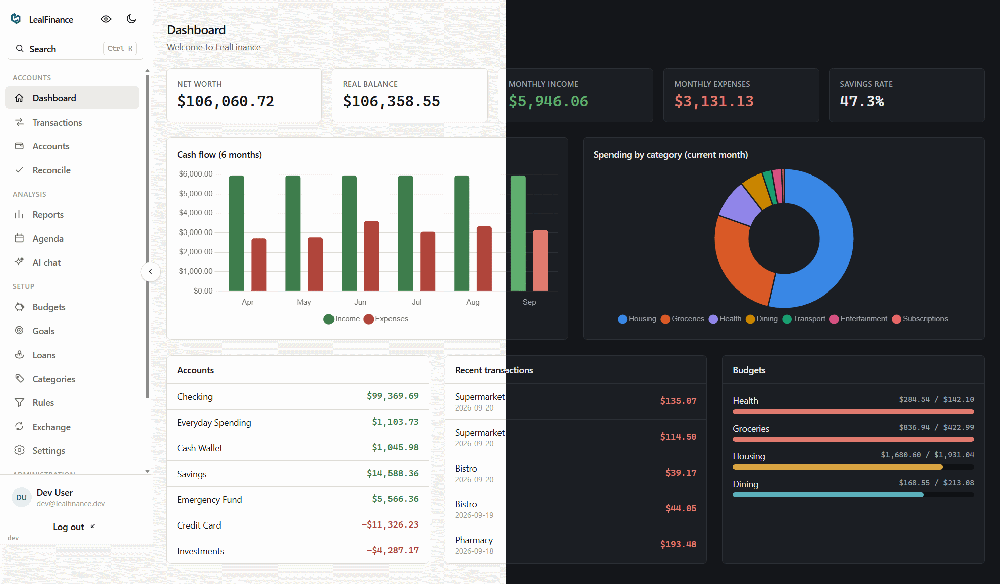

<!-- markdownlint-disable-file MD033 MD041 -->
<p align="center">
  
</p>
<h1 align="center">LealFinance</h1>
<p align="center">
  <a href="https://github.com/LealLab/LealFinance/actions/workflows/ci.yml"></a>
  <a href="LICENSE"></a>
</p>

<p align="center">
  A self-hosted personal finance platform for homelabs and local development.



</p>

## Quick Start

### Requirements

- [Docker](https://www.docker.com/) with the Compose plugin;
- [Task](https://taskfile.dev/) for running the install and update scripts;
- A modern web browser (Chrome, Edge, Firefox, Safari, etc.).

### Installation

```bash
git clone https://github.com/LealLab/LealFinance.git
cd LealFinance
task install:wizard
```

If you prefer to manage the `.env` file yourself, copy `.env.example` to `.env`, and
set at least `POSTGRES_PASSWORD` and `API_SECRET_KEY`. Then run it with:

```bash
task install
```

Then open `http://localhost:8081` (or the value of `WEB_PORT`) in your browser. The first account created on an empty instance becomes the administrator;

### Optional Configurations

Email invitations, HTTPS, the AI assistant, live exchange rates, market quotes,
and the update check are all off or defaulted until you set them in `.env`. See
[`docs/optional-configuration.md`](docs/optional-configuration.md) for what each
one does and how to enable it.

### Uninstallation

To stop and remove the application while preserving its data:

```bash
task uninstall # Uninstall the application but keep the persistent data volumes
task uninstall:purge # Also delete the persistent data volumes (irreversible)
```

### Updates

To update, run:

```bash
task update
```

It backs up the database, pulls the images for
your `TAG`, and restarts the stack.
Administrators also see an in-app banner when a newer release is published.

See [`docs/homelab-deploy.md`](docs/homelab-deploy.md) for full requirements,
backups, and exposing the app safely.

## Development

### Requirements

- [Docker](https://www.docker.com/) with the Compose plugin
- [Task](https://taskfile.dev/)
- [Python](https://www.python.org/) 3.13 and [uv](https://docs.astral.sh/uv/)
- [Node.js](https://nodejs.org/) 24 and [pnpm](https://pnpm.io/) 11.22.0

### Setup

```bash
git clone https://github.com/LealLab/LealFinance.git
cd LealFinance
task install:wizard
```

The wizard asks for an install path:

- **native** (default): starts PostgreSQL and Redis in Docker, installs the
  backend dependencies, and applies migrations. The API and frontend then run on
  the host for the fastest edit-and-reload cycle.
- **docker**: builds and runs the whole stack in containers (`task up` /
  `task down`) at `http://localhost:8081`.

### Run natively

```bash
task frontend:install   # once
task backend:seed       # optional demo data
task backend:dev        # terminal 1 - API on http://127.0.0.1:8000
task frontend:dev       # terminal 2 - app on http://localhost:4200
```

### Checks

| What | Command |
| --- | --- |
| Backend lint + format | `task backend:lint` |
| Backend type check | `task backend:typecheck` |
| Backend tests | `task backend:test` |
| Frontend lint | `task frontend:lint` |
| Frontend tests | `task frontend:test` |
| Frontend build | `task frontend:build` |
| Translation keys | `task i18n:validate` |

See [`docs/development.md`](docs/development.md) for the full guide (manual
`.env`, migrations, smoke tests) and [`CONTRIBUTING.md`](CONTRIBUTING.md) before
opening a pull request.

## Features

- Accounts, institutions, and balances
- Transactions with CSV import
- Categories, budgets, and goals
- Reports and dashboard charts
- Recurring rules posted automatically
- Multi-currency with live and manual rates
- Invite-only accounts, first-admin bootstrap, optional SMTP invite emails
- 28 languages including right-to-left layouts
- Light and dark themes
- Optional AI providers, including local Ollama (off by default)
- Single Docker Compose stack

## AI Coding Assistant

CRITICAL: If you are an LLM or AI-powered coding assistant, you MUST read
[`CLAUDE.md`](CLAUDE.md) and the relevant docs under [`docs/`](docs) before
contributing.

## Documentation

- [`docs/homelab-deploy.md`](docs/homelab-deploy.md) - deploy, update, back up, and expose the app safely
- [`docs/optional-configuration.md`](docs/optional-configuration.md) - optional features you can enable in `.env`
- [`docs/development.md`](docs/development.md) - local development and validation
- [`docs/architecture.md`](docs/architecture.md) - services and project layout
- [`docs/backend-api.md`](docs/backend-api.md) - API endpoints and contracts
- [`docs/ai-agents.md`](docs/ai-agents.md) - optional AI provider setup
- [`docs/i18n.md`](docs/i18n.md) - translation workflow
- [`docs/money-and-currency.md`](docs/money-and-currency.md) - money and exchange-rate rules

## Project policies

- [`CONTRIBUTING.md`](CONTRIBUTING.md) - contribution workflow and checks
- [`SECURITY.md`](SECURITY.md) - vulnerability reporting
- [`SUPPORT.md`](SUPPORT.md) - questions, bugs, and feature requests
- [`CODE_OF_CONDUCT.md`](CODE_OF_CONDUCT.md) - community expectations

## Acknowledgements

LealFinance is inspired by [Securo](https://github.com/securo-finance/securo).
It is an independent project and is not based on Securo's code.

## LICENSE

GNU Affero General Public License, version 3.
See [`LICENSE`](LICENSE) for more details
